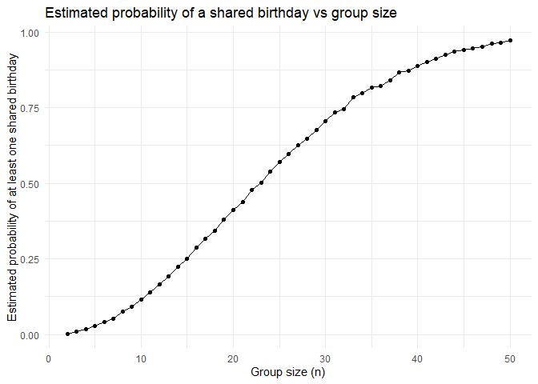
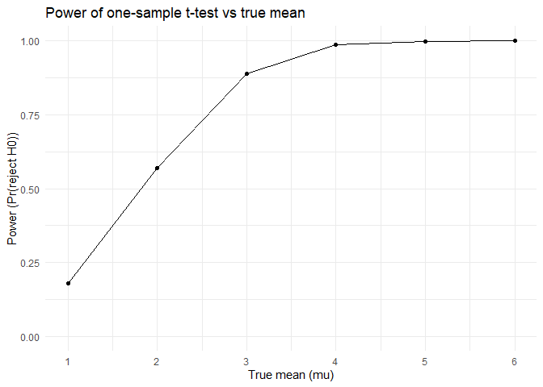
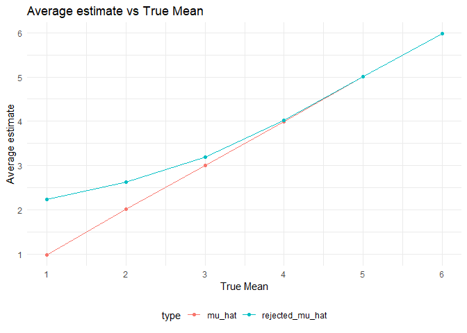
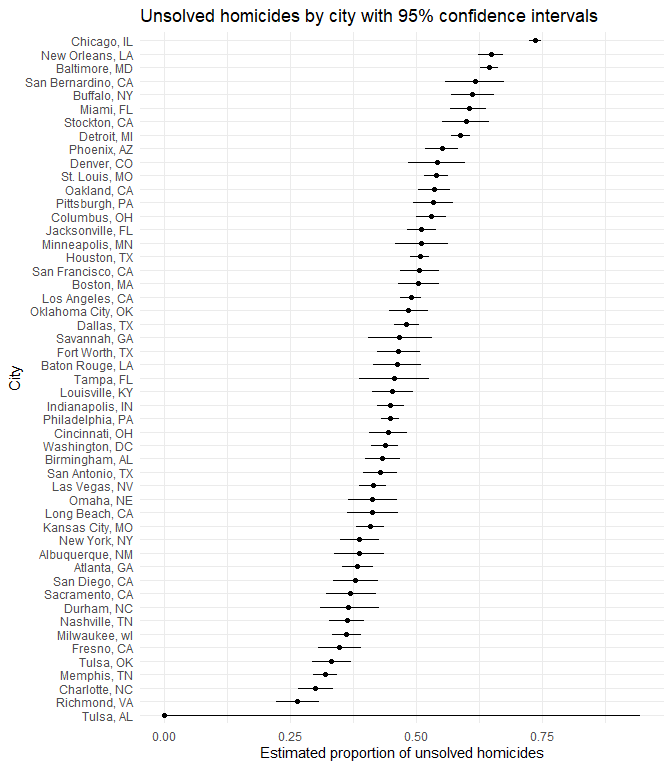

P8105 Homework 5
================
2025-11-06 Hantang Qin

# Problem 1

``` r
sim_has_match = function(n) {
  birthdays = sample(1:365, size = n, replace = TRUE)
  
  any(duplicated(birthdays))
}

set.seed(1)

group_sizes = 2:50       
n_sims      = 10000     

birthday_results =
  tibble(group_size = group_sizes) %>%
  mutate(
    prob_match = map_dbl(
      group_size,
      ~ {
        logical_vec = replicate(n_sims, sim_has_match(.x))
        mean(logical_vec)
      }
    )
  )

birthday_results
```

    ## # A tibble: 49 × 2
    ##    group_size prob_match
    ##         <int>      <dbl>
    ##  1          2     0.0024
    ##  2          3     0.0085
    ##  3          4     0.0167
    ##  4          5     0.0267
    ##  5          6     0.0399
    ##  6          7     0.0521
    ##  7          8     0.0751
    ##  8          9     0.0925
    ##  9         10     0.116 
    ## 10         11     0.139 
    ## # ℹ 39 more rows

``` r
birthday_results %>%
  ggplot(aes(x = group_size, y = prob_match)) +
  geom_line() +
  geom_point() +
  labs(
    x = "Group size (n)",
    y = "Estimated probability of at least one shared birthday",
    title = "Estimated probability of a shared birthday vs group size"
  ) +
  theme_minimal()
```

<!-- -->

When the group size get to about 23 people, the probability that at
least two share a birthday is already around 50% and continues to
increase as the group gets larger. Once the group size is above about 45
people, that probability is very high and is closer to 1.

------------------------------------------------------------------------

# Problem 2

``` r
set.seed(2)

n       = 30
sigma   = 5
mu_vec  = 0:6      
n_sims  = 5000     

sim_t_once = function(mu, n = 30, sigma = 5) {
  x = rnorm(n, mean = mu, sd = sigma)
  
  test_res = t.test(x, mu = 0)
  
  tidy_res = broom::tidy(test_res)
  
  tibble(
    mu       = mu,                 
    estimate = tidy_res$estimate, 
    p_value  = tidy_res$p.value  
  )
}

sim_results =
  map_dfr(mu_vec, ~ {
    sims = replicate(n_sims, sim_t_once(.x, n = n, sigma = sigma),
                     simplify = FALSE)
    bind_rows(sims)
  })


glimpse(sim_results)
```

    ## Rows: 35,000
    ## Columns: 3
    ## $ mu       <int> 0, 0, 0, 0, 0, 0, 0, 0, 0, 0, 0, 0, 0, 0, 0, 0, 0, 0, 0, 0, 0…
    ## $ estimate <dbl> 1.1433591, -0.1752478, -1.2292362, 0.9007918, 0.3367115, -0.1…
    ## $ p_value  <dbl> 0.294723802, 0.868262871, 0.226335415, 0.380723311, 0.7353751…

## Power vs true μ

``` r
power_results =
  sim_results %>%
  group_by(mu) %>%
  summarize(
    power = mean(p_value < 0.05),
    .groups = "drop"
  )

power_results %>%
  filter(mu > 0) %>%                 # drop mu = 0
  ggplot(aes(x = mu, y = power)) +
  geom_line() +
  geom_point() +
  scale_x_continuous(breaks = 1:6) +
  scale_y_continuous(limits = c(0, 1),
                     breaks = seq(0, 1, by = 0.25)) +
  labs(
    x = "True mean (mu)",
    y = "Power (Pr(reject H0))",
    title = "Power of one-sample t-test vs true mean"
  ) +
  theme_minimal()
```

<!-- -->

When the true effect is larger, it becomes easier to detect, meaning
that a larger effect size is associated with higher power.

``` r
est_results =
  sim_results %>%
  filter(mu > 0) %>%                     
  group_by(mu) %>%
  summarize(
    mu_hat          = mean(estimate),                 
    rejected_mu_hat = mean(estimate[p_value < 0.05]), 
    .groups = "drop"
  )

est_results  
```

    ## # A tibble: 6 × 3
    ##      mu mu_hat rejected_mu_hat
    ##   <int>  <dbl>           <dbl>
    ## 1     1  0.981            2.24
    ## 2     2  2.01             2.63
    ## 3     3  3.00             3.19
    ## 4     4  4.00             4.03
    ## 5     5  5.01             5.02
    ## 6     6  5.98             5.98

``` r
# make the plot
Averageestimateplot2 =
  est_results %>%
  pivot_longer(
    mu_hat:rejected_mu_hat,
    names_to  = "type",
    values_to = "mu_esti"
  ) %>%
  ggplot(aes(x = mu, y = mu_esti, colour = type)) +
  geom_line() +
  geom_point() +
  scale_x_continuous(breaks = seq(0, 6, by = 1)) +    
  scale_y_continuous(breaks = seq(0, 6, by = 1)) +
  labs(
    title = "Average estimate vs True Mean",
    x = "True Mean",
    y = "Average estimate"
  ) +
  theme_minimal() +
  theme(legend.position = "bottom")

Averageestimateplot2
```

<!-- -->

The sample average of over all simulated tests is approximately equal to
the true value , because is an unbiased estimator. Between the two
conditions, this overall sample mean is therefore the most accurate
predictor. In contrast, when we take the sample average of only across
tests for which the null hypothesis is rejected, this conditional mean
tends to be larger than the true , since small estimates are unlikely to
lead to rejection and are effectively removed. As increases and the
power of the test grows, it becomes harder to accept the null
hypothesis, fewer small values are filtered out, and the sample average
of given rejection moves closer to the true value , which is consistent
with the pattern shown in the plot.\`

------------------------------------------------------------------------

# Problem 3

``` r
homicide_raw =
  read_csv("homicide-data.csv") %>%   
  janitor::clean_names()

homicide_raw
```

    ## # A tibble: 52,179 × 12
    ##    uid        reported_date victim_last  victim_first victim_race victim_age
    ##    <chr>              <dbl> <chr>        <chr>        <chr>       <chr>     
    ##  1 Alb-000001      20100504 GARCIA       JUAN         Hispanic    78        
    ##  2 Alb-000002      20100216 MONTOYA      CAMERON      Hispanic    17        
    ##  3 Alb-000003      20100601 SATTERFIELD  VIVIANA      White       15        
    ##  4 Alb-000004      20100101 MENDIOLA     CARLOS       Hispanic    32        
    ##  5 Alb-000005      20100102 MULA         VIVIAN       White       72        
    ##  6 Alb-000006      20100126 BOOK         GERALDINE    White       91        
    ##  7 Alb-000007      20100127 MALDONADO    DAVID        Hispanic    52        
    ##  8 Alb-000008      20100127 MALDONADO    CONNIE       Hispanic    52        
    ##  9 Alb-000009      20100130 MARTIN-LEYVA GUSTAVO      White       56        
    ## 10 Alb-000010      20100210 HERRERA      ISRAEL       Hispanic    43        
    ## # ℹ 52,169 more rows
    ## # ℹ 6 more variables: victim_sex <chr>, city <chr>, state <chr>, lat <dbl>,
    ## #   lon <dbl>, disposition <chr>

Dataset contains 12 variables and 52179 observations from 28 states.
There are 52179 recorded victim race entries. Key variables include
victim demographics like: age, race, sex, last name, and case
disposition.

``` r
homicide_city =
  homicide_raw %>%
  mutate(
    city_state = str_c(city, state, sep = ", ")
  ) %>%
  group_by(city_state) %>%
  summarize(
    total_homicides = n(),
    unsolved = sum(
      disposition %in% c("Closed without arrest", "Open/No arrest")
    )
  )

homicide_city
```

    ## # A tibble: 51 × 3
    ##    city_state      total_homicides unsolved
    ##    <chr>                     <int>    <int>
    ##  1 Albuquerque, NM             378      146
    ##  2 Atlanta, GA                 973      373
    ##  3 Baltimore, MD              2827     1825
    ##  4 Baton Rouge, LA             424      196
    ##  5 Birmingham, AL              800      347
    ##  6 Boston, MA                  614      310
    ##  7 Buffalo, NY                 521      319
    ##  8 Charlotte, NC               687      206
    ##  9 Chicago, IL                5535     4073
    ## 10 Cincinnati, OH              694      309
    ## # ℹ 41 more rows

``` r
baltimore =
  homicide_city %>%
  filter(city_state == "Baltimore, MD")

baltimore
```

    ## # A tibble: 1 × 3
    ##   city_state    total_homicides unsolved
    ##   <chr>                   <int>    <int>
    ## 1 Baltimore, MD            2827     1825

In Baltimore, MD, there were 2,827 homicides in the dataset, and 1,825
of these were unsolved, which is about 65% of all cases.

``` r
city_results =
  homicide_city %>%
  mutate(
    prop_test = map2(
      unsolved,
      total_homicides,
      ~ prop.test(x = .x, n = .y)
    ),
    prop_tidy = map(prop_test, broom::tidy)
  ) %>%
  unnest(prop_tidy)

city_results
```

    ## # A tibble: 51 × 12
    ##    city_state    total_homicides unsolved prop_test estimate statistic   p.value
    ##    <chr>                   <int>    <int> <list>       <dbl>     <dbl>     <dbl>
    ##  1 Albuquerque,…             378      146 <htest>      0.386   19.1    1.23e-  5
    ##  2 Atlanta, GA               973      373 <htest>      0.383   52.5    4.32e- 13
    ##  3 Baltimore, MD            2827     1825 <htest>      0.646  239.     6.46e- 54
    ##  4 Baton Rouge,…             424      196 <htest>      0.462    2.27   1.32e-  1
    ##  5 Birmingham, …             800      347 <htest>      0.434   13.8    2.05e-  4
    ##  6 Boston, MA                614      310 <htest>      0.505    0.0407 8.40e-  1
    ##  7 Buffalo, NY               521      319 <htest>      0.612   25.8    3.73e-  7
    ##  8 Charlotte, NC             687      206 <htest>      0.300  109.     1.41e- 25
    ##  9 Chicago, IL              5535     4073 <htest>      0.736 1231.     1.28e-269
    ## 10 Cincinnati, …             694      309 <htest>      0.445    8.11   4.41e-  3
    ## # ℹ 41 more rows
    ## # ℹ 5 more variables: parameter <int>, conf.low <dbl>, conf.high <dbl>,
    ## #   method <chr>, alternative <chr>

``` r
city_results %>%
  mutate(
    city_state = fct_reorder(city_state, estimate)
  ) %>%
  ggplot(aes(x = city_state, y = estimate)) +
  geom_point() +
  geom_errorbar(aes(ymin = conf.low, ymax = conf.high), width = 0) +
  coord_flip() +
  labs(
    x = "City",
    y = "Estimated proportion of unsolved homicides",
    title = "Unsolved homicides by city with 95% confidence intervals"
  ) +
  theme_minimal()
```

<!-- -->
